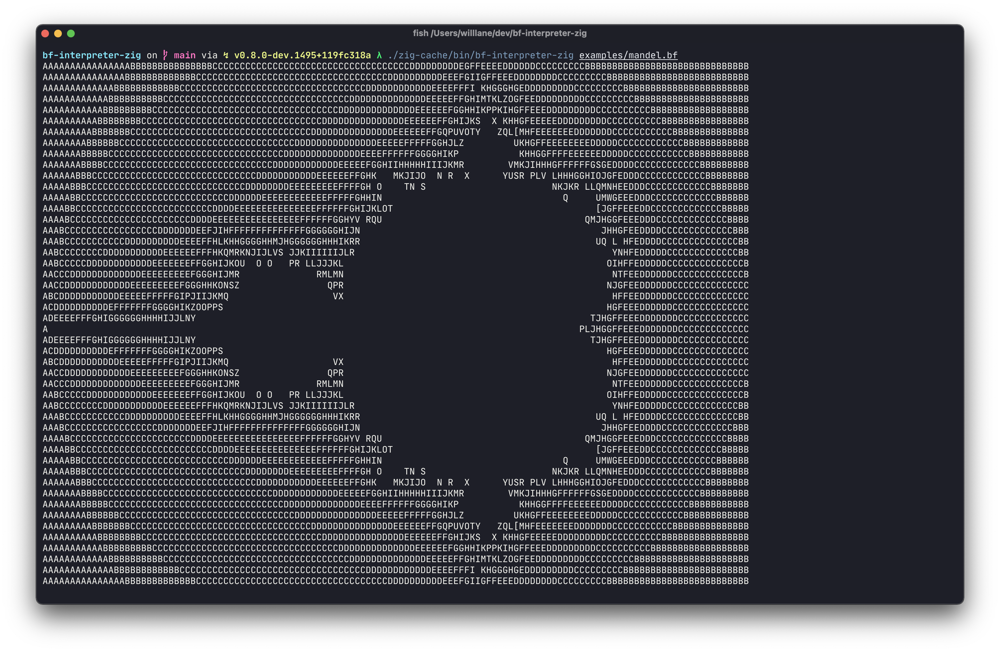

# bf-interpreter-zig

## Rules
- \> move cell pointer forward
- < move cell pointer backward
- \+ increment current cell
- \- decrement current cell
- , take a character as input and assign to current cell
- . output character value of current cell
- [ start loop
- ] end loop if current cell is zero
